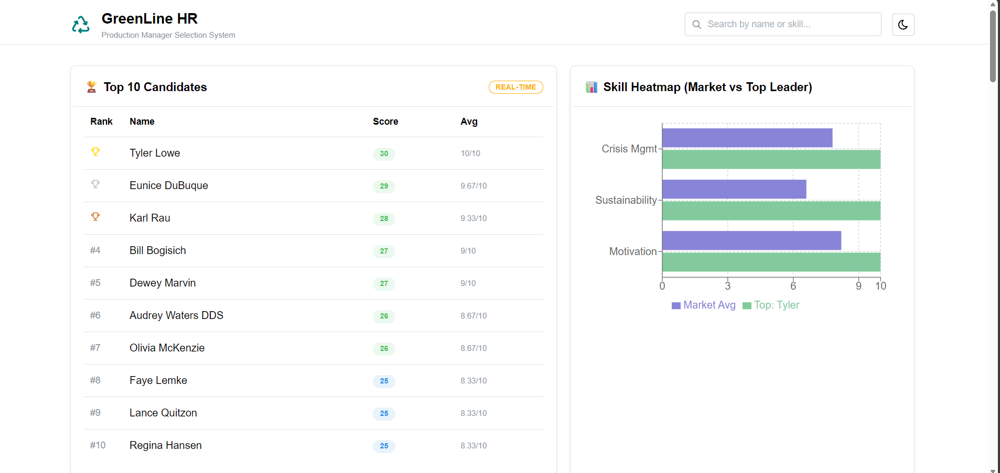
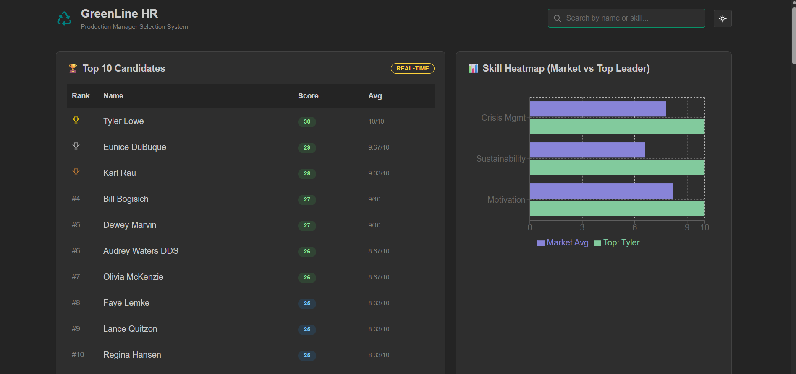

# Recycling Production Line Manager Selection System - Assignment Submission

This repository contains a full-stack equivalent system designed to evaluate and rank candidates for the Recycling Production Line Manager role. It focuses on a clean, scalable MySQL database design, realistic data simulation, and a premium React dashboard for HR decision-making.

## 🚀 Features

### 📸 Dashboard Preview

#### Light Mode - Top 10 Leaderboard & Skill Heatmap


#### Dark Mode - Top 10 Leaderboard & Skill Heatmap


#### Candidates List


#### Search Results - Updated List & Heatmap


- **Database Design**: MySQL-compatible schema with triggers for auto-updating rankings.
- **AI Simulation**: Prompts for evaluating Crisis Management, Sustainability, and Motivation.
- **Data Generation**: Scripts to generate realistic candidate profiles and scores using `Faker.js`.
- **Dashboard**:
  - 🏆 **Leaderboard**: Top 10 candidates sorted by total score.
  - 📊 **Skill Heatmap**: Visual comparison of market average vs. top candidate.
  - 📇 **Candidate Profiles**: Detailed cards with scores and feedback.
  - 🔍 **Search**: Filter candidates by name or skill.

## 🛠️ Setup Instructions

### Prerequisites
- Node.js (v18+)
- MySQL (Optional: for importing `schema.sql` and `dummy_data.sql`)

### Installation

1. Clone the repository:
   ```bash
   git clone <repository-url>
   cd recycling-mgr-system
   ```

2. Install dependencies:
   ```bash
   npm install
   ```

### Data Generation (Optional)
The project comes with pre-generated data (`src/data/candidates.json`). To regenerate:
```bash
node scripts/seed.js
```
This will update `src/data/candidates.json` and `database/dummy_data.sql`.

### Running the Dashboard
```bash
npm run dev
```
Open [http://localhost:5173](http://localhost:5173) to view the system.

## 📂 Project Structure

- `database/`: SQL schema and dummy data.
- `scripts/`: Data generation scripts (`seed.js`).
- `ai-prompts/`: Markdown file with AI prompts (`prompts.md`).
- `src/`: React frontend code.
  - `components/`: UI components (Leaderboard, Heatmap, etc.).
  - `data/`: JSON data consumed by the frontend.

## 🎨 Tech Stack
- **Frontend**: React, Vite, Mantine UI, Recharts.
- **Data**: Faker.js.
- **Database**: MySQL (Schema).
